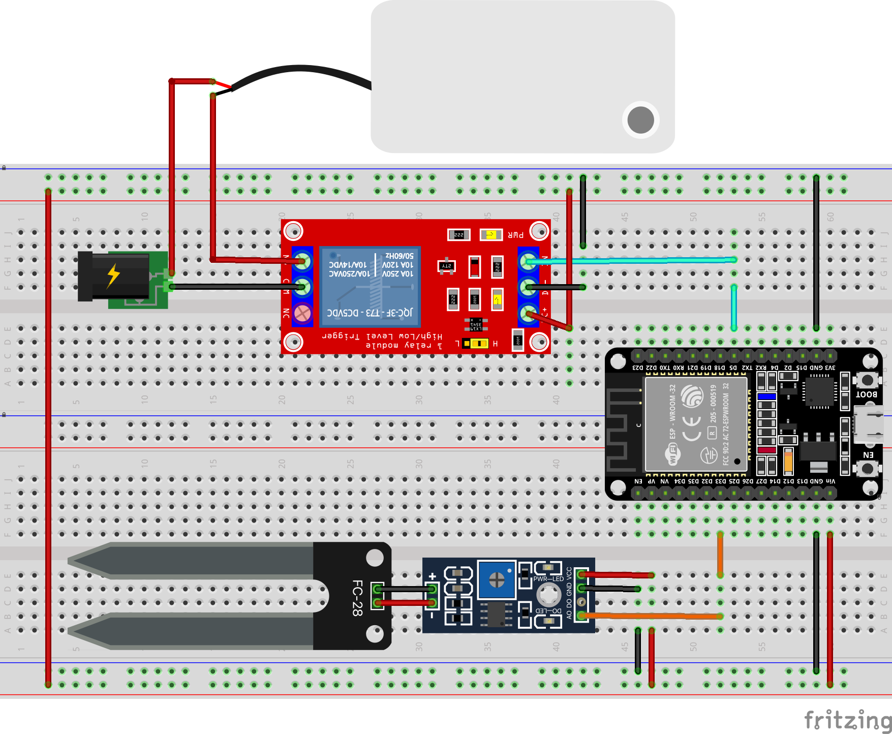

<!-- Improved compatibility of back to top link: See: https://github.com/othneildrew/Best-README-Template/pull/73 -->
<a name="readme-top"></a>

<!-- PROJECT SHIELDS -->

<!-- PROJECT -->
<br />

<div align="center">

  <h3 align="center">Irrigação Automática com NodeMCU ESP32</h3>

  <p align="center">
    A Revolução Verde Automatizada!
    <br />
    <a href="https://github.com/othneildrew/Best-README-Template"><strong>Explore os documentos »</strong></a>
    <br />
  </p>
</div>


<!-- TABLE OF CONTENTS -->

<details>
  <summary>Índice</summary>
  <ol>
    <li>
      <a href="#about-the-project">Sobre o projeto</a>
      <ul>
        <li><a href="#built-with">Construido com</a></li>
      </ul>
    </li>
    <li>
      <a href="#getting-started">Começando</a>
      <ul>
        <li><a href="#prerequisites">Pré-requisitos</a></li>
        <li><a href="#installation">Instalação e montagem</a></li>
      </ul>
    </li>
    <li><a href="#usage">Uso</a></li>
    <li><a href="#roadmap">Roadmap</a></li>
    <li><a href="#license">License</a></li>
    <li><a href="#contact">Desenvolvedores</a></li>
  </ol>
</details>


<!-- ABOUT THE PROJECT -->

## Sobre o projeto

Este projeto propõe a utilização do NodeMCU ESP32 como alternativa de automatizar o processo de irrigação em cultivos. Uma maneira convencional de aumentar a produtividade agrícola. A combinação de sensor de Umidade do Solo e minibomba de água, são essenciais para otimização e gestão da irrigação deste projeto.

<p align="right">(<a href="#readme-top">back to top</a>)</p>


### Desenvolvido com

Neste projeto, utilizamos uma combinação de ferramentas, linguagens e frameworks para criar uma solução robusta e eficiente:

* [![VisualCode][VisualCode]][VisualCode-url]
* [![PlataformIO][PlataformIO]][PlataformIO-url]
* [![Arduino IDE][ArduinoIDE]][Arduino-url]


Para este projeto específico, optamos por utilizar o Visual Code com a extensão PlataformIO, pois oferece uma interface mais moderna e eficiente para o desenvolvimento de código, além de fornecer recursos avançados que facilitam a gestão e o desenvolvimento do firmware para o ESP32. Também mantivemos o uso do Framework do Arduino para programação e instalação do firmware no dispositivo ESP32.

<p align="right">(<a href="#readme-top">back to top</a>)</p>


<!-- GETTING STARTED -->

## Começando
Programamos o ESP32 usando Visual Code com Plataform IO. Então, certifique-se ter o ambiente de desenvolvimento devidamente configurado antes de continuar para os pré-requisitos:

- Configuração de Ambiente de Desenvolvimento (Não Iniciado)

### Pré-requisitos

Dependencias:

Os usuários do Linux precisam instalar regras do udev para placas/dispositivos suportados pelo PlatformIO. Para relizar essa instalação use no Terminal:

```bash
curl -fsSL https://raw.githubusercontent.com/platformio/platformio-core/develop/platformio/assets/system/99-platformio-udev.rules | sudo tee /etc/udev/rules.d/99-platformio-udev.rules
```

Aqui está uma lista das peças que você precisa para construir o circuito:

- ESP32 DEVKIT V1;
- Breadboard;
- Jumper wires;
- Sensor de Umidade de Solo;
- 1 Mini Bomba de Água (d’água) para Arduino RS-385;
- 1 Módulo Relé 5V 10A 1 Canal com Optoacoplador;
- 1 Fonte de Alimentação Chaveada 12VDC 1A;
- 1,5 Metros de Mangueira para Aquário;

Biblioteca externas necessárias:

- [PubSubClient](https://github.com/knolleary/pubsubclient?utm_source=platformio&utm_medium=piohome) - Fizemos a instalação via Plataform IO, não fizemos instalação manual, para ver o passo a passo de como foi feito clique [**aqui**](https://github.com/Laryfernandes/NodeMCU-ESP32/tree/main/documentation/mqtt-lib_step-by_step).


<details>
  <summary>Instalação e montagem</summary>

  <h4>Instalação do Hardware</h4>
  

  <details>
    <summary>Montagem Física:</summary>
    <ol>
      <li>
        <h5>Conexões na Breadboard:</h5>
        <ul>
          <li>Conecte o ESP32 DEVKIT V1 à breadboard.</li>
          <li>Conecte o Sensor de Umidade de Solo à breadboard.</li>
          <li>Conecte a Mini Bomba de Água à breadboard.</li>
          <li>Conecte o Módulo Relé à breadboard.</li>
          <li>Conecte a Fonte de Alimentação Chaveada à Mini Bomba de Água e ao Módulo Relé.</li>
        </ul>
      </li>
      <li>
        <h5>Conexão da Mangueira:</h5>
        <ul>
          <li>Fixe uma extremidade da Mangueira para Aquário em um recipiente com água.</li>
          <li>Conecte a outra extremidade da Mangueira para Aquário na entrada da Mini Bomba de Água.</li>
          <li>Conecte outra mangueira na saída da Mini Bomba de Água.</li>
          <li>Dirija a outra extremidade desta mangueira até a planta que será irrigada.</li>
        </ul>
      </li>
      <li>
        <h5>Conexões Elétricas:</h5>
        <ul>
          <li>Utilize jumper wires para interligar os pinos correspondentes do ESP32, Sensor de Umidade de Solo, Mini Bomba de Água, Módulo Relé e Fonte de Alimentação Chaveada, seguindo o esquemático do circuito.</li>
        </ul>
      </li>
    </ol>
  </details>

  <details>
    <summary>Configuração do Software</summary>
    <ol>
      <li>
        <h5>Instalação das Bibliotecas:</h5>
        <ul>
          <li>Certifique-se de ter o Visual Studio Code com a extensão PlatformIO instalado.</li>
          <li>Abra o projeto no Visual Studio Code.</li>
          <li>No arquivo <code>platformio.ini</code>, verifique se a biblioteca PubSubClient está listada nas dependências. (Lembre-se de Instala)</li>
        </ul>
      </li>
      <li>
        <h5>Configuração do Código:</h5>
        <ul>
          <li>Abra o arquivo do código-fonte do projeto <code>main.cpp</code>.</li>
          <li>Verifique se as configurações do ESP32 estão corretas, como a configuração do WiFi, configurações do MQTT, etc.</li>
          <li>Implemente o código necessário para ler os dados do Sensor de Umidade de Solo, acionar a Mini Bomba de Água através do Módulo Relé, e publicar ou subscrever tópicos MQTT, conforme necessário para o seu projeto.</li>
        </ul>
      </li>
      <li>
        <h5>Compilação e Upload:</h5>
        <ul>
          <li>Compile o código no Visual Studio Code.</li>
          <li>Faça o upload do código compilado para o ESP32.</li>
          <li>Realize o monitoramento para ver se a ESP32 inicializou corretamente, caso não clique o botão reset na placa.</li>
          <li>Apos a conexão efetica com o Wifi e com o Broker MQTT, o ESP32 ira começar a enviar as informações de Umidade, status da bomba e botão de liga e desliga para o Broker.</li>
        </ul>
      </li>
    </ol>
  </details>
</details>


<p align="right">(<a href="#readme-top">back to top</a>)</p>


<!-- USAGE EXAMPLES -->

## Uso
[Em Construção]

<p align="right">(<a href="#readme-top">back to top</a>)</p>

<!-- ROADMAP -->

## Roadmap

- [x] Artigo Científico Parte 1 (13/03/2024)
- [x] Artigo Científico Parte 2 (26/03/2024)
- [x] Artigo Científico Parte 3 (23/04/2024)
- [ ] Desenvolvimento do Projeto e Entrega. (14/05/2024)

<p align="right">(<a href="#readme-top">back to top</a>)</p>

<!-- LICENSE -->

## License

Distribuído sob a Licença MIT. Consulte `LICENSE.txt` para obter mais informações.

<p align="right">(<a href="#readme-top">back to top</a>)</p>


<!-- CONTACT -->

## Desenvolvedores

Nicolas Soares - [@N1koDev](https://github.com/N1koDev)

Laryssa Fernandes - [@Laryfernandes](https://twitter.com/your_username)


<p align="right">(<a href="#readme-top">back to top</a>)</p>

<!-- MARKDOWN LINKS & IMAGES -->
<!-- https://www.markdownguide.org/basic-syntax/#reference-style-links -->

<!-- Construido com: -->
[C++]: https://img.shields.io/badge/C%2B%2B-00599C?style=for-the-badge&logo=c%2B%2B&logoColor=white
[C++.url]: https://www.w3schools.com/cpp/cpp_intro.asp#:~:text=C%2B%2B%20is%20a%20cross%2Dplatform,over%20system%20resources%20and%20memory.

[ArduinoIDE]: https://img.shields.io/badge/Arduino-00979D?style=for-the-badge&logo=Arduino&logoColor=white
[Arduino-url]: https://www.arduino.cc/en/software

[Espressif]: https://img.shields.io/badge/espressif-E7352C?style=for-the-badge&logo=espressif&logoColor=white
[Espressif-url]: https://www.espressif.com/

[PlataformIO]: img/Plataform_IO.svg
[PlataformIO-url]: https://platformio.org/

[VisualCode]: https://img.shields.io/badge/Visual_Studio_Code-0078D4?style=for-the-badge&logo=visual%20studio%20code&logoColor=white
[VisualCode-url]: https://code.visualstudio.com/

[Schematic]: documentation/schematic_flitzing/schematic_v2.png